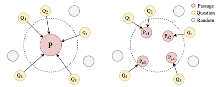

# DCSR

Code for Paper [Sentence-aware Contrastive Learning for Open-Domain Passage Retrieval.](https://arxiv.org/abs/2110.07524) ACL2022 Main Conference, Long Paper. DCSR aims to elliminate the occurence of *Contrastive Conflicts*, in order to provide a more general dense retriever model for pratical use.

This code is mainly based on [DPR](https://github.com/facebookresearch/DPR). We thank the their authors for open sourcing their code.

##  Features


The problem of Contrastive Conflicts (left) and our Solution (right). Given that relationship between queries and documents is not one-to-one, some semantically different queries might be pulled together by the same document. We propose to alter the modelling granularity from document to contextual sentence to decrease the occurence of such conflicts.

##  Environment and Installation

DCSR uses the same environment as [DPR](https://github.com/facebookresearch/DPR). Experimentally we use python==3.7.11, pytorch==1.7.1

```
git clone https://github.com/chengzhipanpan/DCSR
cd DCSR
pip install -r requirements.txt
pip install en_core_web_sm-3.0.0-py3-none-any.whl
```

##  Data Preprocessing

```
# Prepare Data for Training
bash train_scripts/prepare_dataset.sh

# Prepare Data for Evaluation
bash train_scripts/prepare_wiki.sh
```


##  Training and Evaluation

Sample scripts for training
```
# training multiset
bash train_scripts/train_multiset.sh
# training NQ
bash train_scripts/train_nq.sh
# training SQuAD
bash train_scripts/train_squad1.sh
# training Trivia
bash train_scripts/train_trivia.sh
```

Sample script for evaluation
```
bash train_scripts/eval_multiset.sh
```

##  Pretrained Models

Our pretrained models can be accessed via the following links.

1. NQ-single [Google Drive](https://drive.google.com/file/d/1W48ZGATZ8KzwjWmZ7WnNL9lOdnClqN9I/view?usp=sharing) 
2. Trivia-single [Google Drive](https://drive.google.com/file/d/12FFVSQNftLMD5WJDwaSdm9PcbmJUa-If/view?usp=sharing)
3. SQuAD-single [Google Drive](https://drive.google.com/file/d/1LcY-55yxjwbBUJrB-FZYgEBQbPNMkv9w/view?usp=sharing)
4. Multiset [Google Drive](https://drive.google.com/file/d/17AHtX-hlpaSdyhGfOHy4487-mEK2YOTP/view?usp=sharing)


##  Citation

If you find this work useful, please cite the following paper:

```
@inproceedings{wu2022sentence,
  title={Sentence-aware Contrastive Learning for Open-Domain Passage Retrieval},
  author={Wu, Bohong and Zhang, Zhuosheng and Wang, Jinyuan and Zhao, Hai},
  booktitle={The 60th Annual Meeting of the Association for Computational Linguistics (ACL 2022)},
  year={2022}
}
```
